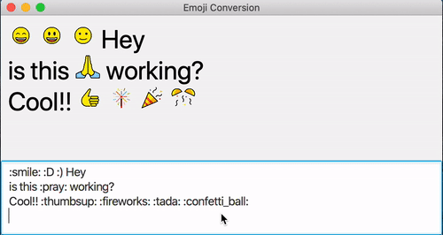

# Description
An extended JavaFX TextFlow with custom emoji images 
which helps you to achieve consistency in your JavaFX 
cross-platform UI applications displaying emojis along text.

It helps you to parse a plane text with emoji aliases with : around the alias
(ex. :smile: ) or unicode emoji symbols
to custom emoji images with text  
and wraps it in custom EmojiTextFlow that is based on JavaFX TextFlow

See demo GIFs with examples under `doc/img`

## How to use
Example code is in:
`src/main/java/ExampleJavaFXEmojiTextFlow.java`

run this example with:
```bash
./gradlew exampleEmojiTextFlowWithListView
```

## How to run example codes

#### Example of using EmojiTextFlow:
```bash
./gradlew exampleEmojiTextFlowWithListView
```
#### running example with *emojitwo* images:


#### Example real time typing and converting to emoji
```bash
./gradlew exampleTypingTextConversion
```
#### running example with *openmoji* images:



#### Example search emoji by their :name: (ex. :smile:)
##### WARNING: 
There is an old example code from https://github.com/UltimateZero/EmojiOneJava 
In this example EmojiTextFlow is NOT used. 
```bash
./gradlew oldExampleEmojiSearch
```
#### running example with *twemoji* images:


## Free emoji packs used in this project:

OpenMoji: https://github.com/hfg-gmuend/openmoji

Twemoji: https://github.com/twitter/twemoji

EmojiTwo: https://github.com/EmojiTwo/emojitwo/

you can add your own ...

## How to add my own emoji pack and use it instead of default ones?

> NOTE:
> you need to make sure you follow same naming of your 
> emoji `.png` files as in this project. 
> (See in `emoji_images` there are all 
> lowercase unicode emoji names for each emoji image file;
> emoji.json is used to search your files by names.)

#### 1. put your `my_awesome_emoji_pack` in `./emoji_images` next to other packs
#### 2. in `settings.gradle` give a value to `emojiImagesPath` variable like this:

> WARNING! the name of variable should be the save as your custom
> emoji pack directory name! In this example both are: `my_awesome_emoji_pack`
```gradle
gradle.ext.emojiImagesPath = 'my_awesome_emoji_pack'
```

#### 3. in terminal run:
```bash
./gradlew buildJar
```
#### 4. grab your custom emoji pack `jar` of EmojiTextFlow from `build/libs` and place it to your other project as a dependency

#### HINT: It is not necessary to have all emoji images in `.jar`
You can create your own emoji pack with 
only few of emoji .png images and recompile it by yourself. 
It will dramatically reduce `.jar` file size.

### Credits:
https://github.com/UltimateZero/EmojiOneJava